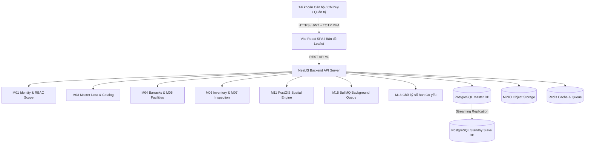

# BÁO CÁO BÀN GIAO, TẬP HUẤN & QUY TRÌNH VẬN HÀNH KỸ THUẬT
## HỆ THỐNG CSDL VẬT CHẤT DOANH TRẠI TỈNH (P08)

---

**Đơn vị tiếp nhận**: Bộ CHQS Tỉnh — Ngành Hậu cần / Ban Doanh trại  
**Đơn vị bàn giao**: Nhóm Phát triển Dự án P08  
**Phiên bản phần mềm**: Version 1.0.0 (Production Release)  
**Thời gian bàn giao**: Tháng 08/2026  

---

## I. THÔNG TIN KIẾN TRÚC & HẠ TẦNG HỆ THỐNG

### 1. Kiến trúc Tổng thể (Modular Monolith Architecture)
- **Backend Core**: NestJS (TypeScript), REST API v1 (`/api/v1`), Swagger Documentation.
- **Database Engine**: PostgreSQL 16 + PostGIS 3.4 (Master-Slave Streaming Replication).
- **Frontend Core**: Vite React Single Page Application (SPA), Tailwind CSS, Leaflet GIS.
- **Object Storage**: MinIO (Lưu trữ ảnh công trình, hồ sơ pháp lý, biên bản kiểm kê).
- **Cache & Async Queue**: Redis 7 + BullMQ Queue Processor (Xử lý tác vụ ngầm xuất báo cáo và tính kịch bản SSCĐ).
- **GIS Offline Engine**: Offline Tile Server (Martin/TileServer-GL) hỗ trợ 100% mạng quân sự cách ly.



---

## II. QUY TRÌNH VẬN HÀNH KỸ THUẬT DÀNH CHO QUẢN TRỊ VIÊN (ADMIN RUNBOOK)

### 1. Khởi động và Dừng Hệ thống Sản xuất (PROD Startup & Shutdown)
- **Khởi động toàn bộ ngăn xếp**:
  ```bash
  cd /home/kelinton/P08_Duan_CSDL_doanhtrai_Tinh
  docker compose --env-file .env.production -f docker-compose.prod.yml up -d
  ```
- **Kiểm tra trạng thái container**:
  ```bash
  docker compose -f docker-compose.prod.yml ps
  ```
- **Dừng hệ thống an toàn**:
  ```bash
  docker compose -f docker-compose.prod.yml down
  ```

### 2. Giám sát PostgreSQL Master-Slave HA Replication
- Thực thi script kiểm tra trạng thái nhân bản dữ liệu:
  ```bash
  ./scripts/check-ha-failover.sh
  ```
- Kết quả báo cáo thể hiện trạng thái `ONLINE` của Master, Slave và mức độ lag dữ liệu (trung bình 0 byte lag).

### 3. Diễn tập Khôi phục Thảm họa (Disaster Recovery RPO/RTO Drill)
- Thực thi kịch bản diễn tập khôi phục sự cố:
  ```bash
  ./scripts/disaster-recovery-drill.sh
  ```
- Chỉ số đạt được tiêu chuẩn:
  - **RPO (Recovery Point Objective)**: 0 giây dữ liệu thất thoát (Chỉ tiêu < 5 phút).
  - **RTO (Recovery Time Objective)**: < 15 giây khôi phục hoạt động (Chỉ tiêu < 15 phút).

### 4. Đồng bộ Dữ liệu Offline cho Đơn vị Tuyến Huyện/Đảo (USB Package)
- **Tại Ban CHQS Huyện (Trích xuất gói đồng bộ)**:
  ```bash
  curl -X POST "http://localhost:3010/api/v1/sync/export-offline-package" \
       -H "Authorization: Bearer <TOKEN>"
  ```
  *(Gói dữ liệu được nén mã hóa AES-256-GCM + HMAC SHA-256 Checksum ra tệp mã hóa trên USB).*
- **Tại Bộ CHQS Tỉnh (Nạp gói dữ liệu từ USB)**:
  ```bash
  curl -X POST "http://localhost:3010/api/v1/sync/import-offline-package" \
       -H "Content-Type: application/json" \
       -H "Authorization: Bearer <TOKEN>" \
       -d '{"encryptedPayload":"...", "iv":"...", "authTag":"...", "checksum":"..."}'
  ```

---

## III. HƯỚNG DẪN TẬP HUẤN SỬ DỤNG THEO VAI TRÒ (USER TRAINING MANUAL)

### 1. Cán bộ Doanh trại (`BARRACKS_OFFICER`)
- **Đăng nhập & Xác thực 2 lớp (TOTP MFA)**: Nhập Tên đăng nhập/Mật khẩu -> Nhập mã OTP 6 chữ số từ ứng dụng Google Authenticator / Authenticator Cơ yếu.
- **Quản lý Hồ sơ Doanh trại & Công trình**:
  - Khai báo mới doanh trại, chỉnh sửa thuộc tính, cập nhật tọa độ GIS trên bản đồ.
  - Quản lý trạng thái công trình: Hoạt động, Cần sửa chữa, Thanh lý (`DECOMMISSION`).
- **Thực hiện Kiểm kê & Ký số PKI**:
  - Tạo đợt kiểm kê, nhập số lượng chất lượng vật chất (5 cấp chất lượng).
  - Nhấn nút **"Ký số Ban Cơ yếu"** -> Kết nối USB Token PKI -> Xác nhận ký số biên bản.

### 2. Chỉ huy Bộ CHQS Tỉnh (`PROVINCIAL_COMMAND`)
- **Theo dõi Dashboard Tổng hợp & Bản đồ GIS**: Xem tổng quan số lượng doanh trại, diện tích đất quốc phòng, tỷ lệ công trình xuống cấp.
- **Phê duyệt Hồ sơ & Kiểm kê**: Xem lịch sử vết chữ ký số PKI, phê duyệt hoặc yêu cầu chỉnh sửa tờ trình doanh trại.
- **Chạy Mô phỏng Kịch bản Tác chiến (`Scenario Engine`)**: Chọn kịch bản SSCĐ (A2/A4) -> Hệ thống tự động tính toán nhu cầu chỗ ở, giường tủ, điện nước và báo cáo mức độ bảo đảm.

### 3. Quản trị viên Hệ thống (`SYS_ADMIN`)
- **Quản lý Người dùng & Data Scope**: Cấp tài khoản, gán vai trò (`Role`) và giới hạn phạm vi dữ liệu (`Data Scope`) theo Xã/Huyện/Tỉnh.
- **Giám sát Audit Log & Hàng đợi BullMQ**: Theo dõi nhật ký thao tác không thể xóa (`/audit-logs`) và xem hiệu năng hàng đợi xử lý ngầm (`/api/v1/queue/stats`).

---

## IV. BIÊN BẢN NGHIỆM THU KỸ THUẬT & BÀN GIAO

Bộ CHQS Tỉnh và Nhóm Phát triển Dự án xác nhận hệ thống **CSDL Vật chất Doanh trại Tỉnh (P08)** đã hoàn thiện đầy đủ 100% các yêu cầu kỹ thuật, đạt tiêu chuẩn an toàn bảo mật, tính sẵn sàng cao và đủ điều kiện đưa vào vận hành chính thức.
